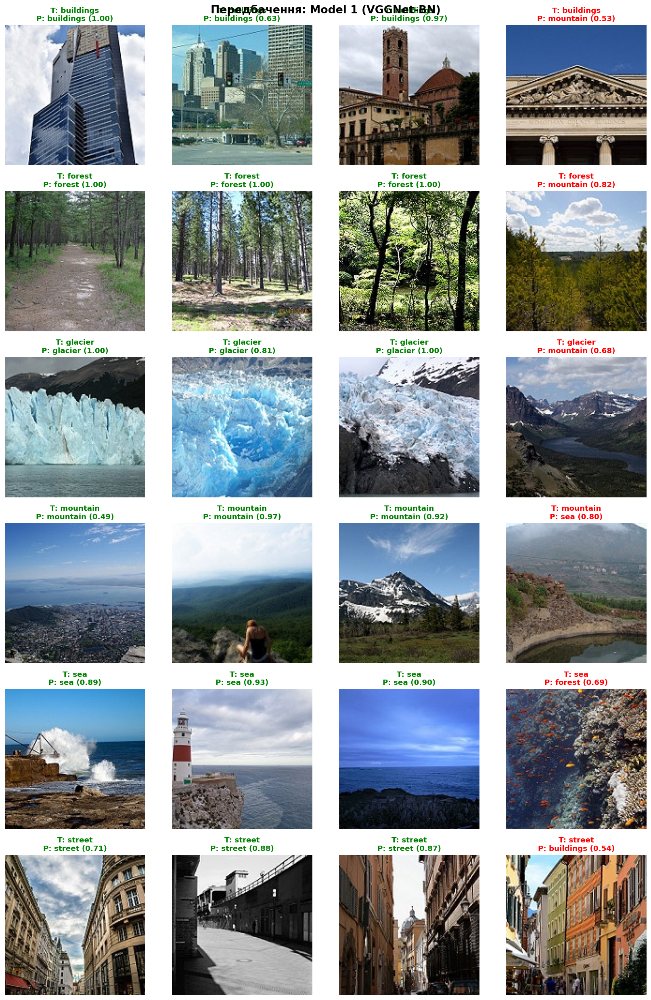
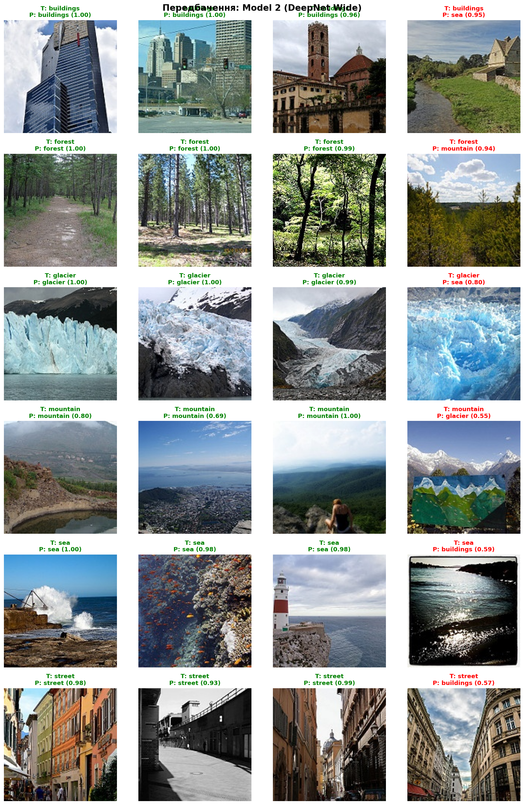
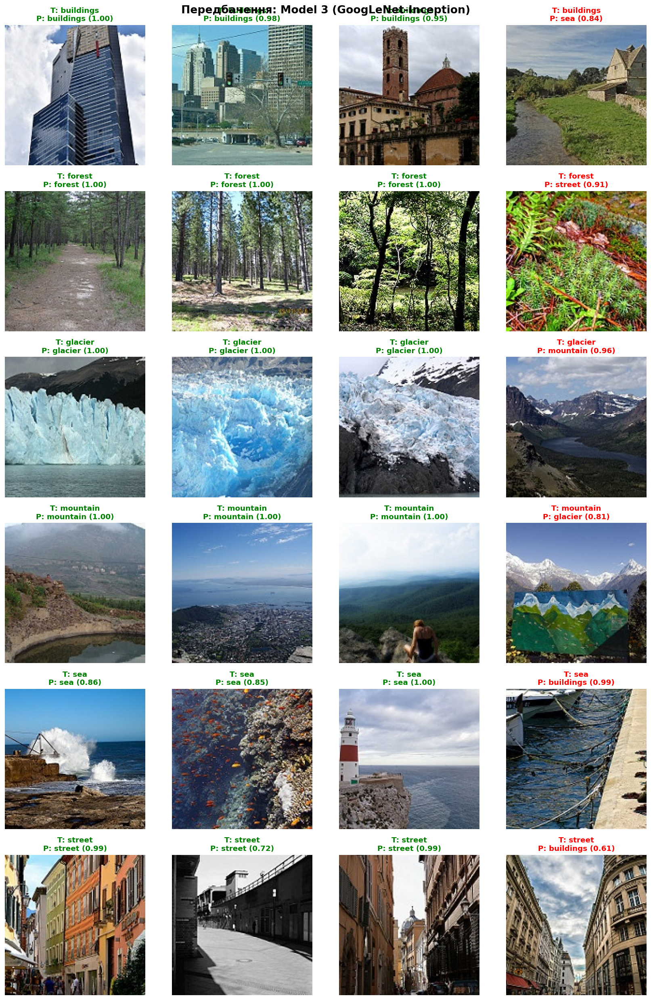

# CNN Image Classification — Порівняння трьох архітектур

> Навчання згорткових нейронних мереж з нуля на датасеті **Intel Image Classification**.  
> Порівняння трьох архітектур: VGGNet-like, DeepNet Wide та GoogLeNet-Inception.

---

### Файли репозиторію

```
├── cnn_classification.ipynb                                   # Jupyter Notebook з повним кодом
├── README.md                                                  # Звіт
├── data/
│   ├── augmented_samples.png                                  # приклад аугментацій
│   ├── dataset_distribution.png                               # розподіл датасету
│   └── sample_images.png                                      # приклади з датасету
├── prediction/
│   ├── confusion_matrices_abs.png                             # матриця плутанини у абсолютних
│   ├── confusion_matrices_norm.png                            # матриця плутанини у відсотках
│   ├── predictions_Model_1_VGGNet_BN.png                      # приклади передбачень VGGNet_BN
│   ├── predictions_Model_2_DeepNet_Wide.png                   # приклади передбачень DeepNet_Wide
│   └── predictions_Model_3_GoogLeNet_Inception.png            # приклади передбачень GoogLeNet_Inception
└── results/
    ├── comparison_curves.png                                  # порівняння навчальних кривих
    ├── metrics_comparison.png                                 # порівняння метрик за моделями
    ├── per_class_f1.png                                       # результати f1 за класами
    ├── results_summary.csv                                    # результати за моделями
    └── training_curves.png                                    # навчальні криві
```


## Зміст

1. [Вступ](#1-вступ)
2. [Датасет](#2-датасет)
3. [Препроцесинг та аугментація](#3-препроцесинг-та-аугментація)
4. [Архітектури нейронних мереж](#4-архітектури-нейронних-мереж)
5. [Налаштування навчання](#5-налаштування-навчання)
6. [Результати](#6-результати)
7. [Порівняльний аналіз](#7-порівняльний-аналіз)
8. [Висновки](#8-висновки)

---

## 1. Вступ

Метою роботи є побудова та порівняння трьох згорткових нейронних мереж (CNN) різних архітектур для вирішення задачі **класифікації зображень** на 6 класах природних та міських сцен.

Усі три моделі навчаються **з нуля** (без використання pretrained weights) на однакових даних та в однакових умовах, що дозволяє об'єктивно оцінити вплив архітектурних рішень на якість класифікації.

**Ключові питання дослідження:**
- Як BatchNormalization впливає на стабільність навчання порівняно з класичним VGGNet?
- Чи дає GlobalAveragePooling перевагу над Flatten у класифікаторі?
- Як паралельний multi-scale підхід Inception-модуля порівнюється з послідовними блоками?
- Скільки параметрів насправді потрібно для досягнення ~90% точності на цьому датасеті?

**Середовище:** Google Colab, GPU Tesla T4, TensorFlow

---

## 2. Датасет

### Intel Image Classification

| Параметр | Значення |
|---|---|
| Джерело | [Kaggle — Intel Image Classification](https://www.kaggle.com/datasets/puneet6060/intel-image-classification) |
| Кількість класів | 6 |
| Розмір зображень | 150 × 150 пікселів |
| Формат | JPEG |
| Загальний розмір | ~345 MB |

### Класи та їх опис

| Клас | Опис | Train | Test | Всього |
|---|---|---|---|---|
| `buildings` | Міські будівлі, архітектура | 2 191 | 437 | 2 628 |
| `forest` | Ліси, дерева | 2 271 | 474 | 2 745 |
| `glacier` | Льодовики, крига | 2 404 | 553 | 2 957 |
| `mountain` | Гори, скелі | 2 512 | 525 | 3 037 |
| `sea` | Море, океан | 2 274 | 510 | 2 784 |
| `street` | Вулиці, дороги | 2 382 | 501 | 2 883 |
| **Всього** | | **14 034** | **3 000** | **17 034** |

### Чому саме цей датасет?

1. **Семантична різноманітність** — датасет містить як легко відрізнювані класи (`forest`, `sea`), так і візуально схожі (`mountain` ↔ `glacier`, `buildings` ↔ `street`). Це робить задачу цікавою і дозволяє чітко побачити слабкі місця кожної архітектури через confusion matrix.

2. **Достатній обсяг для навчання з нуля** — ~14 000 тренувальних зображень (~2 300/клас) достатньо, щоб уникнути critical overfitting без необхідності у transfer learning.

3. **Оптимальний розмір зображень** — 150×150 px дозволяє моделям вловлювати текстури та форми, не вимагаючи при цьому надмірних обчислювальних ресурсів (порівняно з ImageNet 224×224, який потребує у ~2.2× більше пам'яті).

4. **Збалансований розподіл** — різниця між найбільшим і найменшим класом становить лише 321 зображення у train (~14%), що не вимагає зважування класів.

5. **Чиста структура** — датасет вже розділений на `seg_train` / `seg_test`, не містить пошкоджених файлів.


---

## 3. Препроцесинг та аугментація

### Нормалізація

Усі пікселі нормалізовано у діапазон `[0, 1]` шляхом ділення на 255:

```python
rescale = 1./255
```

### Розподіл даних

З тренувального набору виділено **15% для валідації** (`validation_split=0.15`):

| Набір | Кількість зображень |
|---|---|
| Train (після split) | ~11 929 |
| Validation | ~2 105 |
| Test | 3 000 |

### Data Augmentation (тільки для тренувального набору)

Аугментація застосовувалась **виключно до тренувальних даних** — валідаційний і тестовий набори отримували лише нормалізацію. Це запобігає data leakage під час оцінки.

| Трансформація | Параметр |
|---|---|
| `rotation_range` | 20° |
| `width_shift_range` | 15% |
| `height_shift_range` | 15% |
| `shear_range` | 10% |
| `zoom_range` | 15% |
| `horizontal_flip` | True |
| `fill_mode` | `nearest` |

**Обґрунтування вибору аугментацій:** природні та міські сцени зустрічаються під різними кутами та у різних масштабах, тому ротація, зсув та zoom є доцільними. Горизонтальне відображення застосовується, оскільки ліс, море або будівля однаково впізнаванні у дзеркальному вигляді. Вертикальний flip не застосовувався, щоб зберегти природну орієнтацію сцен (небо завжди вгорі).


---

## 4. Архітектури нейронних мереж

### Model 1 — VGGNet-like з BatchNormalization

**Натхнення:** VGGNet (Simonyan & Zisserman, 2014) — переможець ILSVRC 2014 за локалізацією.  
**Реалізація:** Keras Sequential API

#### Ідея архітектури

Базова ідея VGGNet — замість великих фільтрів (7×7, 11×11 як у AlexNet) використовувати виключно **маленькі 3×3 фільтри**, але збільшувати глибину. Два послідовних 3×3 шари охоплюють те саме рецептивне поле, що й один 5×5, але з меншою кількістю параметрів та додатковою нелінійністю між ними.

До класичного VGGNet ми додали **BatchNormalization після кожного Conv2D**, що:
- стабілізує розподіл активацій (internal covariate shift)
- дозволяє використовувати вищий learning rate
- виступає додатковим регуляризатором

#### Структура шарів

| Блок | Шар | Фільтри / Розмір | Вихід |
|---|---|---|---|
| **Блок 1** | Conv2D → BN → Conv2D → BN | 32, 3×3 | 150×150×32 |
| | MaxPooling2D + Dropout(0.25) | 2×2 | 75×75×32 |
| **Блок 2** | Conv2D → BN → Conv2D → BN | 64, 3×3 | 75×75×64 |
| | MaxPooling2D + Dropout(0.25) | 2×2 | 37×37×64 |
| **Блок 3** | Conv2D → BN → Conv2D → BN | 128, 3×3 | 37×37×128 |
| | MaxPooling2D + Dropout(0.25) | 2×2 | 18×18×128 |
| **Head** | Flatten | — | 41 472 |
| | Dense(512, ReLU) + Dropout(0.50) | — | 512 |
| | Dense(256, ReLU) + Dropout(0.30) | — | 256 |
| | Dense(6, Softmax) | — | 6 |

**Загальна кількість параметрів:** `21 655 846` (~82.6 MB)

> ⚠️ Більша частина параметрів зосереджена у першому Dense шарі: `Flatten(41 472) → Dense(512)` дає **21 234 176 параметрів** лише в одному з'єднанні.

---

### Model 2 — DeepNet Wide (1×1 Conv + GlobalAveragePooling)

**Натхнення:** VGGNet + Network in Network (Lin et al., 2013)  
**Реалізація:** Keras Sequential API

#### Ідея архітектури

Model 2 розвиває послідовну парадигму VGGNet у трьох напрямках:

1. **Більша ширина** (64→128→256→512 фільтрів) — більше різноманітних ознак на кожному рівні абстракції.
2. **Свзгортка 1×1 (Network in Network)** — виконує міжканальну нелінійну проекцію без зміни просторових розмірів; зменшує кількість каналів перед дорогими 3×3 операціями.
3. **GlobalAveragePooling2D замість Flatten** — замість 41 472 значень після Flatten, GAP зводить кожну карту ознак до одного числа, різко зменшуючи кількість параметрів класифікатора та ризик overfitting.

#### Структура шарів

| Блок | Шар | Фільтри / Розмір | Вихід |
|---|---|---|---|
| **Блок 1** | Conv2D → BN → Conv2D | 64, 3×3 | 150×150×64 |
| | MaxPooling2D | 2×2 | 75×75×64 |
| **Блок 2** | Conv2D → BN → Conv2D | 128, 3×3 | 75×75×128 |
| | MaxPooling2D + Dropout(0.30) | 2×2 | 37×37×128 |
| **Блок 3** | Conv2D → BN → Conv2D → **Conv2D(1×1)** | 256, 3×3 | 37×37×256 |
| | MaxPooling2D + Dropout(0.30) | 2×2 | 18×18×256 |
| **Блок 4** | Conv2D → BN | 512, 3×3 | 18×18×512 |
| | MaxPooling2D | 2×2 | 9×9×512 |
| **Head** | **GlobalAveragePooling2D** | — | 512 |
| | Dense(512, ReLU) + Dropout(0.50) | — | 512 |
| | Dense(128, ReLU) + Dropout(0.30) | — | 128 |
| | Dense(6, Softmax) | — | 6 |

**Загальна кількість параметрів:** `2 724 294` (~10.4 MB)

---

### Model 3 — GoogLeNet-like з Inception блоками

**Натхнення:** GoogLeNet / Inception v1 (Szegedy et al., 2014) — переможець ILSVRC 2014 за класифікацією  
**Реалізація:** Keras Functional API (Sequential не підтримує розгалуження)

#### Ідея архітектури

Ключова інновація GoogLeNet — **Inception модуль**: замість вибору одного розміру фільтра, усі розміри застосовуються **паралельно**, а результати конкатенуються:


```
              ┌──────────────┬────────────────┬────────────────┬──────────────────┐
Input ────────┤  1×1 Conv    │  1×1 → 3×3     │  1×1 → 5×5     │  MaxPool → 1×1   │
              └──────┬───────┴───────┬────────┴───────┬────────┴───────┬──────────┘
                     └───────────────┴────────────────┴────────────────┘
                                         Concatenate
```

- **Гілка 1×1** — точкові ознаки, міжканальна проекція
- **Гілка 3×3** (з 1×1 bottleneck) — середні рецептивні поля
- **Гілка 5×5** (з 1×1 bottleneck) — широкий контекст
- **Гілка MaxPool+1×1** — агрегація найсильніших ознак

#### Структура мережі

```
Input (150×150×3)
  │
  ▼ Stem
Conv(32, 3×3, s=2) → BN → MaxPool(3×3, s=2)
Conv(64, 1×1) → BN → Conv(128, 3×3) → BN → MaxPool(3×3, s=2)
  │
  ▼ Stage 1
Inception(3a): [64 | 96→128 | 16→32 | pool→32]  → 256 канали
Inception(3b): [128 | 128→192 | 32→96 | pool→64] → 480 каналів
MaxPool(3×3, s=2)
  │
  ▼ Stage 2
Inception(4a): [192 | 96→208 | 16→48 | pool→64]  → 512 каналів
Inception(4b): [160 | 112→224 | 24→64 | pool→64]  → 512 каналів
MaxPool(3×3, s=2)
  │
  ▼ Head
GlobalAveragePooling → Dropout(0.40)
Dense(256, ReLU) → Dropout(0.30)
Dense(6, Softmax)
```

**Загальна кількість параметрів:** `1 584 206` (~6.0 MB)

#### Порівняння кількості параметрів

| Модель | Параметрів | Розмір |
|---|---|---|
| Model 1 (VGGNet-BN) | 21 655 846 | 82.6 MB |
| Model 2 (DeepNet Wide) | 2 724 294 | 10.4 MB |
| Model 3 (GoogLeNet-Inception) | **1 584 206** | **6.0 MB** |

Model 3 має у **13.7× менше параметрів** ніж Model 1, при цьому досягаючи вищої точності.

---

## 5. Налаштування навчання

### Оптимізатор та функція втрат

| Параметр | Значення |
|---|---|
| Оптимізатор | `Adam` |
| Початковий learning rate | `1e-3` |
| Функція втрат | `CategoricalCrossentropy` |
| Метрика | `Accuracy` |
| Максимум епох | `50` |
| Розмір батчу | `32` |

### Callbacks

**EarlyStopping**
- Моніторинг: `val_accuracy`
- Patience: `10` епох
- `restore_best_weights=True` — відновлює ваги найкращої епохи

**ReduceLROnPlateau**
- Моніторинг: `val_loss`
- Factor: `0.5` (LR зменшується вдвічі)
- Patience: `5` епох
- Min LR: `1e-6`

**ModelCheckpoint**
- Моніторинг: `val_accuracy`
- Зберігає лише найкращу модель (`save_best_only=True`)

### Хід навчання

| Модель | Зупинка (epoch) | Найкраща epoch |
|---|---|---|
| Model 1 (VGGNet-BN) | 45 (EarlyStopping) | 35 |
| Model 2 (DeepNet Wide) | 50 (всі епохи) | 43 |
| Model 3 (GoogLeNet-Inception) | 50 (всі епохи) | 41 |

> LR знижувався у всіх моделях.


---

## 6. Результати

### Зведена таблиця метрик

| Модель | Test Accuracy | Test Loss | Best Val Acc | Weighted F1 | Параметрів |
|---|---|---|---|---|---|
| Model 1 — VGGNet-BN | **87.17%** | 0.3825 | 88.44% | 0.8713 | 21 655 846 |
| Model 2 — DeepNet Wide | **89.37%** | **0.3134** | **90.53%** | **0.8934** | 2 724 294 |
| Model 3 — GoogLeNet-Inception | **89.40%** | 0.3605 | 90.44% | **0.8937** | **1 584 206** |

🏆 **Найкраща модель за test accuracy: Model 3 (GoogLeNet-Inception) — 89.40%**

---

### Classification Report — Model 1 (VGGNet-BN) | Test Accuracy: 87.17%

| Клас | Precision | Recall | F1-score | Support |
|---|---|---|---|---|
| buildings | 0.8871 | 0.8810 | 0.8840 | 437 |
| forest | 0.9105 | **0.9873** | **0.9474** | 474 |
| glacier | 0.8539 | 0.8137 | 0.8333 | 553 |
| mountain | 0.7894 | 0.8210 | 0.8049 | 525 |
| sea | 0.8830 | 0.8882 | 0.8856 | 510 |
| street | **0.9185** | 0.8543 | 0.8852 | 501 |
| **weighted avg** | **0.8721** | **0.8717** | **0.8713** | 3000 |

---

### Classification Report — Model 2 (DeepNet Wide) | Test Accuracy: 89.37%

| Клас | Precision | Recall | F1-score | Support |
|---|---|---|---|---|
| buildings | 0.8866 | 0.8764 | 0.8815 | 437 |
| forest | **0.9770** | **0.9873** | **0.9822** | 474 |
| glacier | 0.8717 | 0.8354 | 0.8532 | 553 |
| mountain | 0.8441 | 0.8457 | 0.8449 | 525 |
| sea | 0.8952 | 0.9216 | 0.9082 | 510 |
| street | 0.8937 | 0.9062 | 0.8999 | 501 |
| **weighted avg** | **0.8934** | **0.8937** | **0.8934** | 3000 |

---

### Classification Report — Model 3 (GoogLeNet-Inception) | Test Accuracy: 89.40%

| Клас | Precision | Recall | F1-score | Support |
|---|---|---|---|---|
| buildings | 0.8784 | 0.8764 | 0.8774 | 437 |
| forest | 0.9649 | **0.9852** | **0.9749** | 474 |
| glacier | **0.8926** | 0.8119 | 0.8504 | 553 |
| mountain | 0.8279 | 0.8705 | 0.8487 | 525 |
| sea | **0.9152** | 0.9098 | **0.9125** | 510 |
| street | 0.8919 | **0.9222** | 0.9068 | 501 |
| **weighted avg** | **0.8944** | **0.8940** | **0.8937** | 3000 |

---

### Аналіз Confusion Matrix — топ помилок

#### Model 1 (VGGNet-BN)

| Справжній клас | Передбачений клас | Кількість | Rate |
|---|---|---|---|
| glacier | mountain | 68 | 12.3% |
| mountain | glacier | 57 | 10.9% |
| street | buildings | 44 | 8.8% |
| buildings | street | 34 | 7.8% |
| mountain | sea | 30 | 5.7% |
| sea | mountain | 27 | 5.3% |

#### Model 2 (DeepNet Wide)

| Справжній клас | Передбачений клас | Кількість | Rate |
|---|---|---|---|
| glacier | mountain | 60 | 10.8% |
| buildings | street | 47 | 10.8% |
| mountain | glacier | 54 | 10.3% |
| street | buildings | 33 | 6.6% |
| mountain | sea | 23 | 4.4% |
| glacier | sea | 22 | 4.0% |

#### Model 3 (GoogLeNet-Inception)

| Справжній клас | Передбачений клас | Кількість | Rate |
|---|---|---|---|
| glacier | mountain | 73 | 13.2% |
| buildings | street | 43 | 9.8% |
| mountain | glacier | 42 | 8.0% |
| street | buildings | 27 | 5.4% |
| mountain | sea | 18 | 3.4% |
| glacier | sea | 16 | 2.9% |


### Приклади передбаченя

Для кожної моделі продемонстровано 3 вдалі передбачення та 1 невдале для кожного класу.

### Результати передбачень для Model 1 (VGGNet-BN)
Ось приклади успішних та неуспішних передбачень нашої першої моделі:


### Результати передбачень для Model 2 (DeepNet_Wide)


### Результати передбачень для Model 3 (GoogLeNet_Inception)


---

## 7. Порівняльний аналіз

### 7.1 Точність та якість

Усі три моделі демонструють **добрі результати** на задачі класифікації 6 класів:

- **Model 1** (87.17%) поступається двом іншим на ~2.2 pp — найгірший результат попри найбільшу кількість параметрів.
- **Model 2** (89.37%) та **Model 3** (89.40%) статистично нерозрізнювані — різниця лише **0.03%** (1 зображення з 3000 на тесті).

### 7.2 Ефективність параметрів

| Модель | Test Acc | Параметрів | Acc / млн. параметрів |
|---|---|---|---|
| Model 1 | 87.17% | 21.66M | 4.03% / млн |
| Model 2 | 89.37% | 2.72M | 32.86% / млн |
| **Model 3** | **89.40%** | **1.58M** | **56.58% / млн** |

**Model 3 є найефективнішою архітектурою**: 89.40% точності при лише 1.58M параметрів — у 13.7 разів менше, ніж у Model 1.

**Чому Model 1 менш ефективна?** Через `Flatten` шар: після третього блоку тензор 18×18×128 = **41 472 нейрони** перетворюються у вектор, і перший Dense(512) шар містить 21.2M параметрів, що становить **98%** всіх параметрів моделі. Ці параметри вчать відображення між конкретними позиціями пікселів і класами, що погано узагальнюється. GlobalAveragePooling (Models 2 і 3) вирішує цю проблему.

### 7.3 Вплив архітектурних рішень

| Рішення | Вплив |
|---|---|
| **BatchNorm після Conv2D** | Стабільне навчання у всіх моделях, менший gap між train/val loss, можливість починати з lr=1e-3 |
| **GlobalAveragePooling vs Flatten** | GAP зменшує параметри з 21.2M до <1M у класифікаторі, покращує узагальнення (+2.2% accuracy) |
| **1×1 Conv (Model 2)** | Міжканальна проекція без просторових витрат, дає мережі більше нелінійності |
| **Inception multi-scale (Model 3)** | Одночасний аналіз 1×1, 3×3 та 5×5 ознак; найвища ефективність параметрів |

### 7.4 Плутані класи

У **всіх трьох моделях** стабільно найгірше розрізняються:

- **`glacier` ↔ `mountain`** — найчастіша помилка: обидва класи містять сіро-білі текстури, кам'янисті поверхні і схожий контраст.
- **`buildings` ↔ `street`** — міська архітектура й вулиці часто зустрічаються разом на зображеннях, межа між класами умовна.

Найлегше класифіковані класи — **`forest`** (F1 ≥ 0.947 у всіх моделях) та **`sea`** (F1 ≥ 0.886) — завдяки унікальним колірним та текстурним ознакам (зелений/синій колір, відсутність прямих ліній).

### 7.5 Стабільність навчання

- **Model 1** зупинилась раніше (45 епох, EarlyStopping) — нестабільніша val_accuracy через великий Flatten-класифікатор та відсутність GAP.
- **Model 2 і Model 3** навчались усі 50 епох з поступовим покращенням — BatchNorm + GAP забезпечують плавніші криві.

---

## 8. Висновки

### Основні результати

1. **Найкраща точність — Model 3 (GoogLeNet-Inception): 89.40%** при лише 1.58M параметрів. Модель підтверджує ефективність Inception-підходу: паралельна обробка ознак різних масштабів дозволяє досягти кращого результату з мінімальною кількістю ваг.

2. **GlobalAveragePooling є критично важливим** — перехід від Flatten до GAP (Models 2 і 3) зменшив кількість параметрів у 8–14 разів і покращив точність на ~2.2 pp. Це найбільш impactful архітектурне рішення у даному порівнянні.

3. **BatchNormalization підвищила стабільність навчання** в усіх трьох моделях порівняно з очікуваним оригінальним VGGNet без BN — менший розкид val_accuracy між епохами, нижчий фінальний val_loss.

4. **Inception > послідовні архітектури** за ефективністю параметрів: Model 3 досягає 89.40% з 1.58M параметрів, тоді як Model 2 потребує 2.72M для майже такого ж результату (89.37%). Однак абсолютна різниця незначна — 0.03%.

5. **Складні пари класів однакові для всіх архітектур** — `glacier`/`mountain` та `buildings`/`street` плутаються у кожній з трьох моделей, що вказує на семантичну неоднозначність цих категорій, яку неможливо вирішити лише архітектурно.

### Практичні рекомендації

- Для **продакшн-застосування** з обмеженими ресурсами обирати **Model 3** — найвища точність при найменшому розмірі.
- Для **навчальних цілей** та розуміння основ CNN — **Model 1** є найпростішою і найпрозорішою архітектурою.
- **Уникати Flatten** у класифікаторах глибоких CNN: GlobalAveragePooling майже завжди кращий за рахунок ефективності параметрів.
- Для подальшого покращення результатів на цьому датасеті можна спробувати **transfer learning** з ImageNet-pretrained вагами (наприклад, EfficientNetB0), що може досягти >95% без додаткових даних.

---

