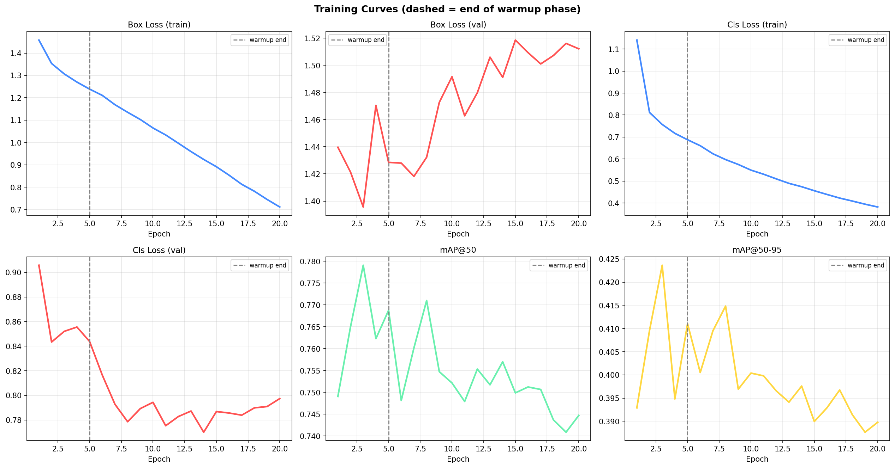
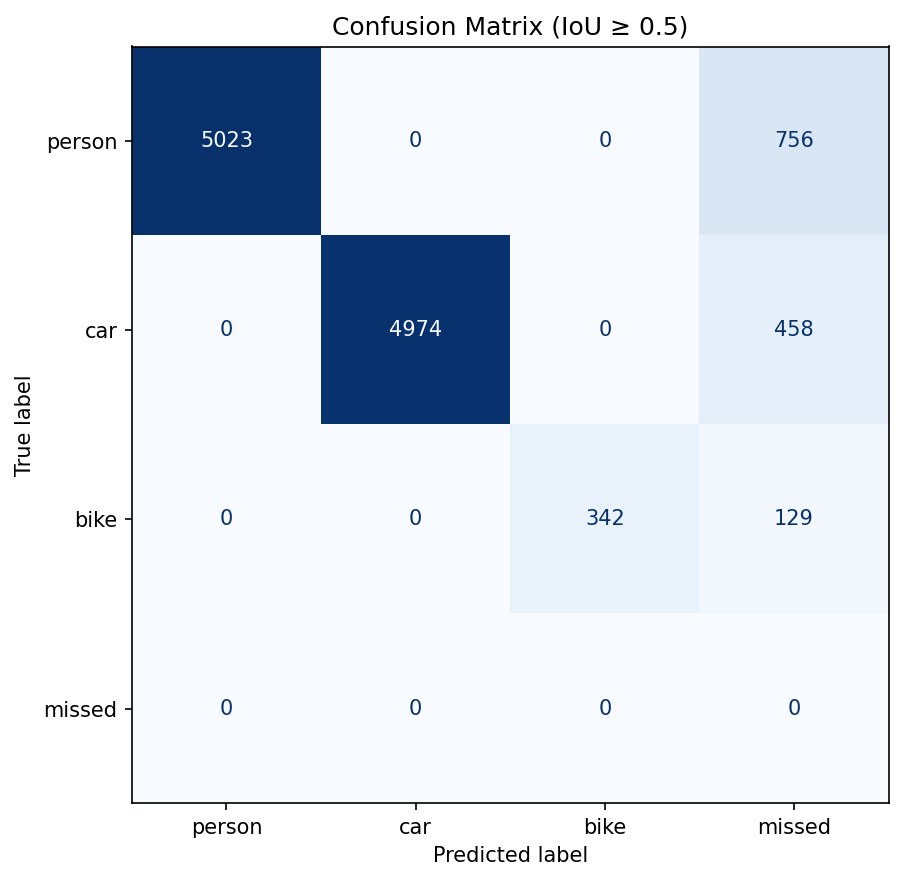
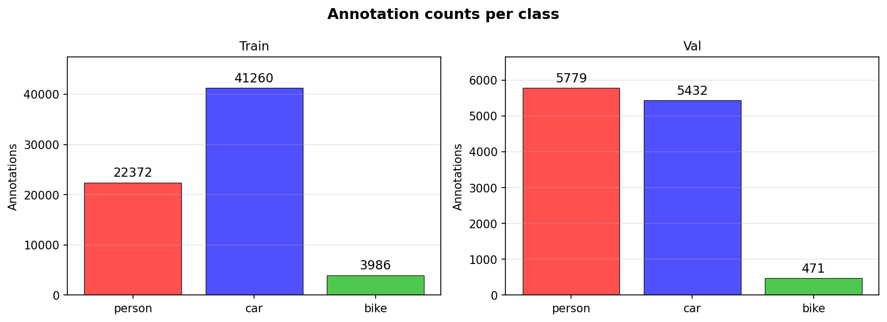
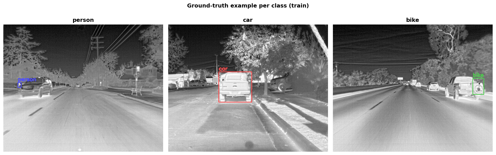
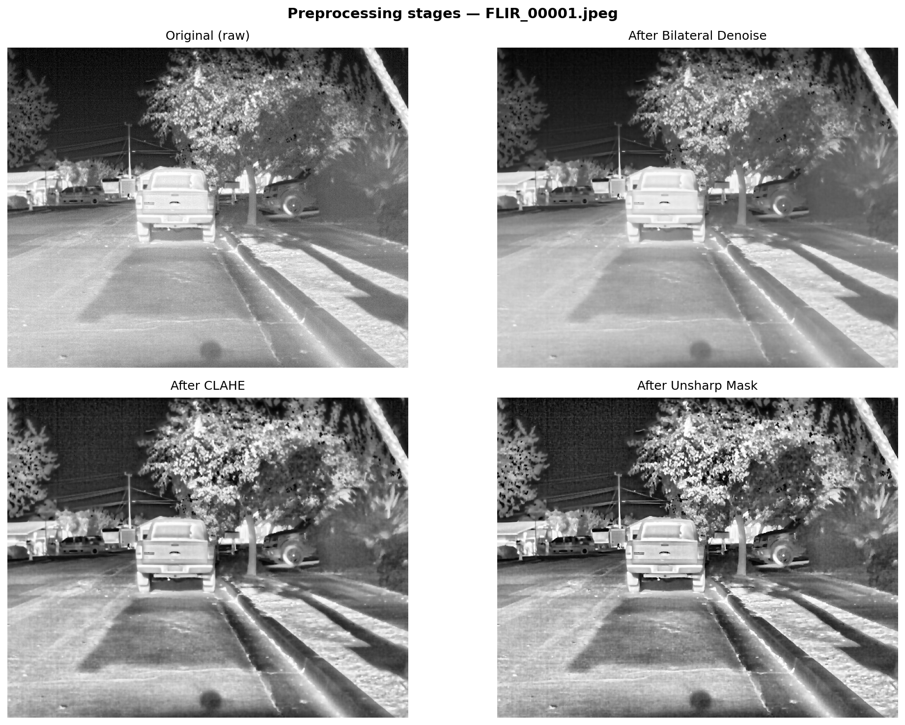
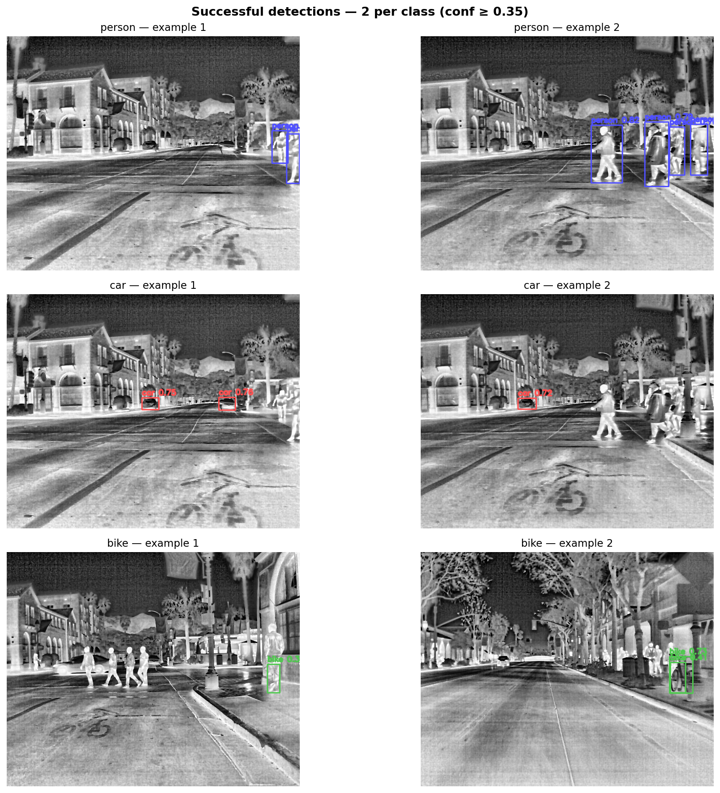
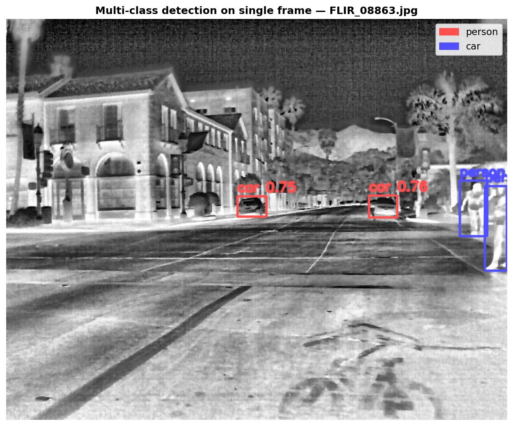

# 🌡️ FLIR Thermal Object Detection — YOLOv8s

Object detection on thermal (infrared) images using YOLOv8s with custom preprocessing and training pipeline.  
**Classes:** `person` · `car` · `bike`

---

## Quick Start

```bash
# 1. Open FLIR_Notebook_v2.ipynb in Google Colab
#    Runtime → Change runtime type → GPU (T4)

# 2. Get your Kaggle API token
#    kaggle.com → Account → API → Create New Token → download kaggle.json

# 3. Run all cells top to bottom
```

> ⚠️ All cells must run in order — each section depends on variables from the previous one.

---

## Repository Structure

```
HW4/
├── FLIR_Notebook_v1.ipynb        # Earlier version (two-phase training)
├── FLIR_Notebook_v2.ipynb        # Current version (single-phase + warmup)
├── README.md
├── referat_thermal_yolo.pdf      # Theoretical writeup
└── flir_export/
    ├── outputs/                  # Notebook-generated figures
    │   ├── eda_class_distribution.png
    │   ├── eda_class_examples.png
    │   ├── preprocessing_stages.png
    │   ├── training_curves.png
    │   ├── confusion_matrix.png
    │   ├── detection_examples.png
    │   └── detection_multiclass.png
    └── runs/
        └── single_phase/         # Ultralytics training artifacts
            ├── weights/
            │   ├── best.pt       # ← best checkpoint (use for inference)
            │   └── last.pt
            ├── results.csv       # per-epoch metrics
            ├── results.png
            ├── BoxF1_curve.png
            ├── BoxP_curve.png
            ├── BoxR_curve.png
            ├── BoxPR_curve.png
            ├── confusion_matrix.png
            ├── confusion_matrix_normalized.png
            ├── labels.jpg
            ├── train_batch*.jpg  # sample training batches
            └── val_batch*_pred.jpg
```

---

## Pipeline Overview

```
Raw thermal JPEG (640×512, grayscale, FLIR 8-bit)
        │
        ▼
  1. Min-Max Normalisation   → equalise brightness across frames
  2. Bilateral Filter        → remove sensor noise, preserve edges
  3. CLAHE                   → boost local contrast (8×8 tiles, clip=2.0)
  4. Unsharp Mask            → sharpen object boundaries (α=0.6)
  5. Gray → 3-ch BGR         → replicate channel for YOLOv8 input
        │
        ▼
  COCO JSON annotations  →  YOLO .txt (filtered to 3 classes)
  train: 7,859 label files  |  val: 1,360 label files
        │
        ▼
  Class balance check → bike already ~24% of max class, no oversampling needed
        │
        ▼
  YOLOv8s training — single phase, 20 epochs
    · warmup 5 epochs  (lr ramps 0 → 1e-4)
    · differential LR: backbone = 1e-5, head = 1e-4
    · fliplr=0.5  (only augmentation)
        │
        ▼
  Evaluation: mAP@50/50-95, F1 per class, MCC, classification report
```

---

## Dataset

| | |
|---|---|
| **Source** | [FLIR Thermal Reduced — Kaggle](https://www.kaggle.com/datasets/albertofv/flir-thermal-images-dataset-reduced) |
| **Format** | COCO JSON → converted to YOLO TXT |
| **Classes** | `person` (0) · `car` (1) · `bike` (2) |
| **Input size** | 640 × 512 px, 8-bit grayscale |
| **Train images** | 8,862 (after preprocessing) |
| **Val images** | 1,366 |
| **Annotation** | Bounding boxes only (detection task) |

> `light` and `sign` classes excluded — not present in this reduced dataset.

---

## Model & Training Config

| Parameter | Value |
|---|---|
| Base model | `yolov8s.pt` (pretrained COCO) |
| Image size | 640 |
| Epochs | 20 |
| Batch | auto (`-1`) → T4 GPU |
| Peak LR (head) | `1e-4` |
| Backbone LR | `1e-5` (10× lower, via `on_train_start` callback) |
| LR schedule | Cosine decay → `1e-6` |
| Warmup epochs | 5 |
| Augmentation | `fliplr=0.5` only — all others disabled |
| Conf threshold | `0.15` |

### Why single-phase + warmup instead of freeze/unfreeze

Thermal images have a large domain gap vs COCO RGB. Two-phase training caused instability at the phase boundary (validation loss spike). Single phase with warmup + differential LR gave smoother convergence: backbone updates 10× slower, preventing catastrophic forgetting of COCO features while still adapting to thermal domain.

---

## Results

### Training Curves



Dashed line = end of warmup (epoch 5). Source: `flir_export/runs/single_phase/results.csv`.

### Per-class Curves

| Curve | What it shows |
|---|---|
| [`BoxF1_curve.png`](flir_export/runs/single_phase/BoxF1_curve.png) | F1 vs confidence threshold |
| [`BoxP_curve.png`](flir_export/runs/single_phase/BoxP_curve.png) | Precision vs confidence |
| [`BoxR_curve.png`](flir_export/runs/single_phase/BoxR_curve.png) | Recall vs confidence |
| [`BoxPR_curve.png`](flir_export/runs/single_phase/BoxPR_curve.png) | Precision-Recall curve |

### Metrics Summary

**Official YOLO validation** (IoU threshold sweep):

| Metric | All classes | person | car | bike |
|---|---|---|---|---|
| **mAP@50** | **0.778** | 0.830 | 0.885 | 0.620 |
| **mAP@50-95** | **0.424** | — | — | — |
| Precision | 0.781 | 0.856 | 0.805 | 0.682 |
| Recall | 0.700 | 0.698 | 0.837 | 0.566 |
| F1 | — | 0.769 | 0.821 | 0.619 |

**Sklearn metrics** (per GT box, IoU ≥ 0.5, matched detections only):

| Metric | person | car | bike | macro |
|---|---|---|---|---|
| F1 | 0.930 | 0.956 | 0.841 | **0.909** |
| Recall | 0.870 | 0.920 | 0.730 | — |

| Global metric | Value |
|---|---|
| **MCC** | **0.820** |
| Accuracy | 0.890 |

### Confusion Matrix



`missed` row = GT boxes not matched by any detection at IoU ≥ 0.5.  
YOLO version: [`runs/single_phase/confusion_matrix.png`](flir_export/runs/single_phase/confusion_matrix.png)
Normalised YOLO version: [`runs/single_phase/confusion_matrix_normalized.png`](flir_export/runs/single_phase/confusion_matrix_normalized.png)

---

## Output Images

### EDA





### Preprocessing (4 key stages)



Original → Bilateral denoise → CLAHE → Unsharp mask.

### Detections



*2 successful detections per class at conf ≥ 0.15.*



*Multiple classes detected simultaneously on one frame.*

---

## Inference

```python
from ultralytics import YOLO

model = YOLO('flir_export/runs/single_phase/weights/best.pt')

results = model.predict(
    'your_thermal_image.jpg',
    conf=0.15,           # lower threshold for weak thermal signatures
    iou=0.5,             # NMS IoU threshold
    agnostic_nms=True,   # suppress cross-class duplicates on same object
)
results[0].show()
```

> **`agnostic_nms=True`** — use when you see duplicate boxes on the same object from different classes. Standard NMS only suppresses within-class duplicates.

---

## Requirements

Installed automatically by the first notebook cell:
```
ultralytics  kaggle
```

Pre-installed in Google Colab:
```
opencv-python  numpy  pandas  matplotlib  scikit-learn  torch  tqdm
```

---

## Known Limitations

- **`bike` AP (0.62)** is lower than `car` (0.88) and `person` (0.83) — fewer training instances even within the balanced dataset
- **Conf = 0.15** is necessary for thermal but increases false positives on background heat sources (trees, warm pavement)
- Model trained on FLIR ADAS (California, summer daytime/night) — may generalise poorly to rain, fog, or different camera models
- `light` and `sign` classes are not supported
